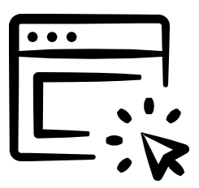

  <table style="width:100%; border-collapse: collapse; border: none;">
    <tr>
      <th></th>
      <th>
        <h1 align = "center">
          Minimalist Résume   
          
          
          
          
          
          
          
          
           
          
          
           
          
          
          
        </h1>
      </th>
    </tr>
  </table>

## Design Motivation

Most of the time, we do not give much attention to a cover letter format while putting an application! Well, to worry no more. Keeping styling and formatting the same as the resume, the document provide minimal design to create a cover letter.

## Usage

You are free to use my design, both personally and/or commercially. However, you are requested to cite the source, which will also help me in producing content like this.

